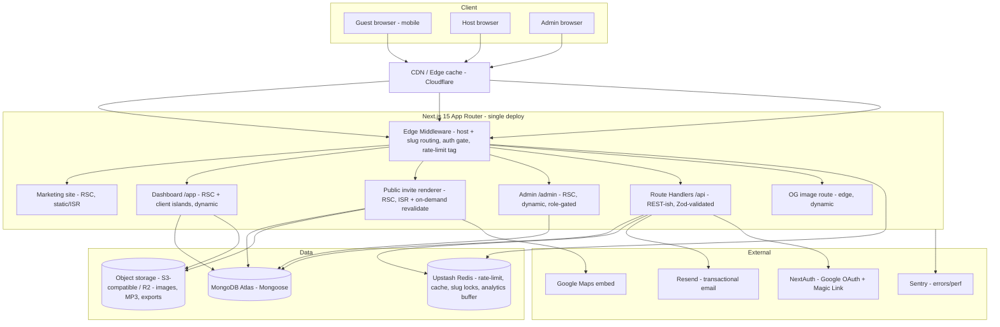

# Shubalekha — System Architecture

**Version:** 1.0
**Status:** Phase 2 — awaiting approval
**Last updated:** 2026-06-09
**Depends on:** [01-PRD.md](01-PRD.md)

---

## 1. Architectural goals

1. **Public invite pages must be fast and cheap to serve at viral scale** — CDN-cached,
   server-rendered, near-zero per-request DB cost once warm.
2. **Three surfaces, one codebase, one deploy** — marketing, dashboard (app), and public
   invite renderer, separated by host/subdomain, sharing models and components.
3. **Host-agnostic** — nothing in the app assumes a specific PaaS; host-specific glue
   (wildcard TLS, cron trigger, blob store binding) is isolated and finalized in Phase 12.
4. **Secure & observable by default** — every mutation guarded; every error traced.

---

## 2. High-level architecture



---

## 3. Surfaces & routing model

Three logical surfaces distinguished by **host**, resolved in **edge middleware** before
any route renders.

| Surface | Host | Route group | Rendering | Cache |
|---|---|---|---|---|
| Marketing | `shubalekha.com`, `www.` | `(marketing)` | RSC, mostly static + ISR | CDN, long TTL |
| Dashboard | `app.shubalekha.com` (or `shubalekha.com/dashboard`) | `(app)` | RSC + client islands, **dynamic** | no-store / per-user |
| Admin | same host, `/admin` | `(admin)` | RSC, dynamic, **role-gated** | no-store |
| Public invite | `*.shubalekha.com` (any other subdomain) | `(public)/_sites/[slug]` | RSC, **ISR + on-demand revalidate** | CDN, cached until revalidated |
| OG image | `*.shubalekha.com/api/og` | route handler | dynamic edge | CDN, cached per slug+version |

### 3.1 Subdomain → slug resolution (middleware)

```
1. Read Host header → strip ":port".
2. Compute the "subdomain" relative to ROOT_DOMAIN (env, e.g. shubalekha.com).
3. Branch:
   - host == ROOT or "www"      → marketing  (pass through)
   - subdomain == "app"         → dashboard  (require session; else redirect to /login)
   - subdomain is RESERVED      → 404 / reserved-handler (admin,api,dashboard,login,signup,
                                   templates,support,about,contact,www,mail,cdn,static,assets,...)
   - else                       → rewrite to /_sites/<subdomain>/<path>  (public invite)
4. Tag request with a rate-limit bucket key (ip + route class) for downstream handlers.
```

- **Reserved words** live in one shared constant + are validated again at slug creation time.
- Middleware does **no DB calls** for public invites — it only rewrites. Existence/lifecycle
  is resolved inside the RSC page (cacheable), so the edge stays cheap.
- Local dev uses `*.localhost` (supported by Chrome/Firefox) or a `?__host=` override helper.

---

## 4. Rendering & caching strategy

The whole performance story (Lighthouse 95+, viral-proof) rests here.

### 4.1 Public invite page (the hot path)
- **React Server Component**, rendered with **ISR**: cached at the CDN/edge; served as static
  HTML to the millions of guests, hydrating only interactive islands (RSVP form, music player,
  gallery lightbox, countdown, guestbook).
- **On-demand revalidation:** when a host publishes or edits, the API calls `revalidateTag('invite:<id>')`
  (and revalidates the OG image + sitemap). Guests always see fresh content "instantly" without
  per-request DB hits — matching the reference product's "edit updates for everyone instantly."
- **Per-guest personalization** (`?to=token`) is handled **without breaking the cache**: the base
  page is cached; the guest name + prefilled RSVP are injected by a small client island that reads
  the token and calls a tiny edge endpoint (the heavy invite HTML stays static & shared).
- **Lifecycle states** (draft/expired) are resolved in the RSC: a draft or expired slug renders the
  appropriate state (404 for unknown, "expired" page for expired) — see §7.

### 4.2 Dashboard / Admin
- Dynamic RSC (`no-store`), per-user data, behind auth. Client islands (Zustand) for editor state,
  optimistic UI, charts. Heavy editor + chart libs are **dynamically imported** / code-split.

### 4.3 Marketing
- Mostly static + ISR; templates gallery revalidates when admin publishes/features a template.

### 4.4 Caching layers summary
1. **CDN edge** — static marketing + ISR invite HTML + OG images.
2. **Next data/route cache** — `revalidateTag`-keyed fetch cache for invite reads.
3. **Redis** — slug-availability, rate-limit counters, hot lookups, analytics write-buffer.
4. **MongoDB** — source of truth; touched on cache miss / mutations only.

---

## 5. Data layer

### 5.1 MongoDB Atlas + Mongoose
- Single primary DB; collections from PRD (User, Template, Invite, RSVP, Analytics aggregate,
  InviteView event, Settings, AuditLog, GuestLink, Guestbook) — full schemas in Phase 3.
- **Serverless connection caching:** a singleton cached Mongoose connection across lambda
  invocations (global cache pattern) to avoid pool exhaustion. Read-heavy invite reads use lean
  queries + projection.
- Indexes defined per collection (e.g. unique `Invite.slug`, `RSVP` dedupe compound index).

### 5.2 Upstash Redis (serverless, REST)
Purposes:
- **Rate limiting** (`@upstash/ratelimit`) — auth, RSVP submit, guestbook, slug-check, all mutations.
- **Slug availability cache & soft-lock** during the publish flow.
- **Hot caches** — featured templates, invite-id-by-slug map.
- **Analytics write-buffer** — view events pushed to Redis, flushed/aggregated by a job to avoid
  hammering Mongo on viral pages.

### 5.3 Object storage (S3-compatible)
- Stores user images (hero, gallery, family photos), **MP3 music**, generated exports (PDF/PNG).
- Served via CDN. Direct, **presigned-URL uploads** from the client (never proxy large files
  through the app server). Image variants via the CDN/image pipeline + `next/image`.
- **Decision needed (defer to Phase 12 with host):** Cloudflare **R2** (zero egress, pairs with
  Cloudflare CDN) is the recommended default; abstracted behind a `StorageProvider` interface so
  S3/Vercel Blob are drop-in.

---

## 6. OG image pipeline (WhatsApp unfurl)

- Dynamic OG route (`/api/og` on the invite host) renders a branded card (couple names, date,
  hero image) using the edge image-generation runtime (e.g. `@vercel/og` / Satori — host-agnostic
  Satori core).
- **Cached per `slug + version`** at the CDN; `version` bumps on edit so previews never go stale.
- Invite `generateMetadata()` emits OpenGraph + Twitter tags pointing at this image, sized for
  WhatsApp (1200×630, plus a square fallback). JSON-LD `Event` structured data + canonical URL.

---

## 7. Lifecycle & expiry engine

States: `Draft → Published → Completed → Expired → (slug released)` (PRD §5.2).

Two complementary mechanisms:

1. **Compute-on-read (authoritative for display):** the invite RSC derives the *effective* state
   from `status`, `eventDate`, and `expiresAt` at render time — so an invite shows "expired"
   the instant it crosses the boundary even before any job runs.
2. **Scheduled job (authoritative for persistence & cleanup):** a daily **cron** (host scheduler /
   Upstash QStash / external trigger → a protected `/api/cron/lifecycle` route secured by a secret):
   - mark `Published`+past-expiry → `Expired`, trigger revalidation,
   - release slugs whose `slugReleaseAt` has passed (free them for reuse),
   - flush analytics buffer & roll up daily aggregates,
   - send RSVP reminder emails that are due.

`expiresAt = eventDate + 10 days`; `slugReleaseAt = expiresAt + 30 days` (PRD).

---

## 8. Authentication & authorization

- **NextAuth** with **Google OAuth** + **Email magic link** (Resend as the mailer).
- **Session:** JWT or database sessions (DB sessions chosen for revocation/disable-user support).
- **RBAC:** `role ∈ {user, admin}` on User; middleware + per-handler guards. Admin surface
  double-checks role server-side (never trust client).
- **Ownership verification:** every invite/RSVP mutation checks `invite.ownerId === session.user.id`
  (or admin). Centralized in a `requireOwner()` / `requireRole()` helper.
- Public invite reads + RSVP submit are **unauthenticated** but rate-limited and validated.

---

## 9. Email (Resend)
Transactional only: magic-link sign-in, publish confirmation, RSVP confirmation + edit link,
RSVP reminders. Templates as React Email components. Sends are queued/rate-limited; failures
logged to Sentry, never block the user request.

---

## 10. Analytics pipeline

```
Guest view → lightweight beacon (edge) → Redis buffer (append)
                                   │
              daily cron / threshold flush
                                   ▼
        aggregate → Analytics docs (per invite, per day, per dimension)
                                   ▼
                 Dashboard reads pre-aggregated docs (cheap charts)
```

- Captured: view, unique (hashed IP+UA per day), device/browser (UA parse), coarse geo
  (edge geo headers), referral source (referrer + `utm`/`src` param → WhatsApp/IG/FB/Google/Direct),
  and **per-guest opens** via `?to=token`.
- **Privacy:** raw IP is hashed for uniqueness then discarded; no precise location stored.

---

## 11. Security architecture (cross-cutting)

- **Validation:** Zod schema on every route handler input (body/query/params) + Mongoose schema
  validation as defense-in-depth.
- **NoSQL injection:** typed/validated inputs only; never pass raw objects to queries; sanitize.
- **XSS:** all user content escaped by React; rich text (if any) sanitized server-side; strict CSP.
- **CSRF:** same-site cookies + NextAuth CSRF; mutations require session or signed token.
- **Rate limiting:** Upstash on auth, slug-check, RSVP, guestbook, exports, all writes.
- **Headers:** CSP, HSTS, X-Content-Type-Options, Referrer-Policy, Permissions-Policy via middleware/config.
- **Secrets:** env-only; never shipped to client; `NEXT_PUBLIC_` strictly for safe values.
- **Audit log:** admin actions + security-sensitive events recorded (AuditLog collection).
- **Abuse:** guestbook moderation, slug reservation, content size caps, upload type/size validation.

---

## 12. Observability & ops

- **Sentry** for client + server errors and performance traces; release tagging.
- Structured server logs; request IDs.
- Health/readiness endpoint; cron endpoint protected by secret + Sentry cron monitor.
- Feature flags / kill-switches via Settings collection (e.g. disable signups, maintenance mode).

---

## 13. Environments & configuration

- `ROOT_DOMAIN`, Mongo URI, Redis REST creds, NextAuth/Google creds, Resend key, storage creds,
  Sentry DSN, cron secret — all via env. A typed `env.ts` (Zod-validated at boot) fails fast on
  missing/invalid config.
- Environments: local (`*.localhost`), preview, production. No host lock-in in app code.

---

## 14. Key decisions & trade-offs

| Decision | Choice | Rationale |
|---|---|---|
| Subdomain routing | Edge middleware host-rewrite to `/_sites/[slug]`, **no DB at edge** | Cheapest hot path; resolution cached in RSC. |
| Invite freshness | ISR + `revalidateTag` on edit/publish | "Instant for everyone" without per-view DB load. |
| Per-guest personalization | Client island + tiny edge call, base page shared-cached | Personalization without fragmenting the CDN cache. |
| Lifecycle | Compute-on-read + nightly cron | Correct display instantly; persistence/cleanup batched. |
| Media | Presigned direct uploads to S3-compatible store behind CDN | Never proxy big files; scalable & cheap. |
| Storage provider | R2 default, behind `StorageProvider` interface | Host-agnostic; pairs with Cloudflare; finalize Phase 12. |
| Sessions | DB sessions | Needed for disable-user / revocation. |
| Analytics | Redis buffer → batch aggregate | Survives viral spikes without DB thrash. |

---

## 15. Open items to confirm before/at later phases
1. **Dashboard host:** `app.shubalekha.com` (cleaner cookie/cache isolation) vs `shubalekha.com/dashboard`
   (simpler). _Recommended:_ `app.` subdomain. → lock in Phase 4.
2. **Object storage provider** (R2 vs S3 vs Vercel Blob). → lock in Phase 12 (interface built now).
3. **Cron trigger** mechanism (host scheduler vs Upstash QStash vs external). → lock in Phase 12.
4. **Session strategy** final (DB confirmed unless you prefer JWT). → Phase 7.

---

## 16. Feeds into next phases
- **Phase 3 (DB):** collections, indexes, lifecycle fields (`expiresAt`, `slugReleaseAt`),
  GuestLink/Guestbook, analytics aggregates.
- **Phase 4 (Folder structure):** route groups `(marketing) (app) (admin) (public)`, `_sites/[slug]`,
  feature modules, `lib/` (db, redis, auth, storage, og, ratelimit, env).
- **Phase 5 (API contracts):** the route handlers referenced above.
