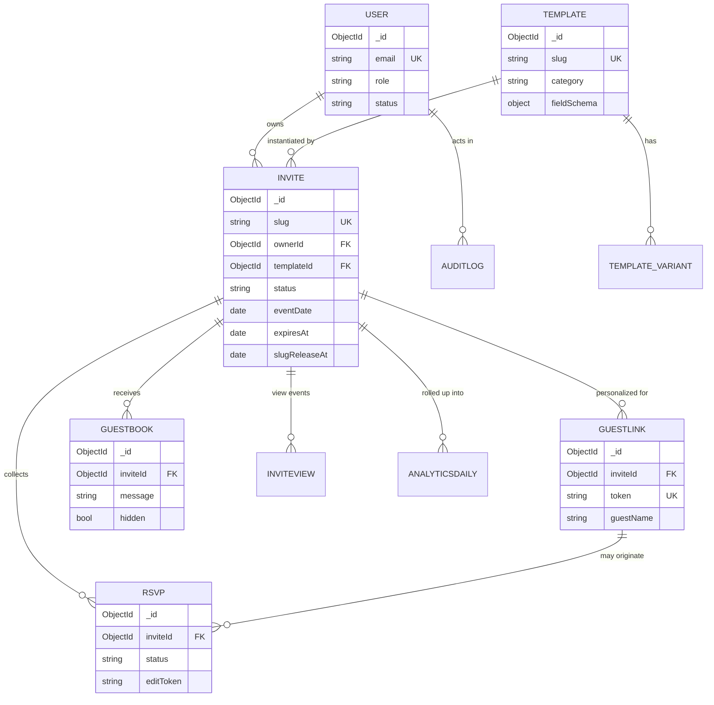

# Shubalekha — Database Design

**Version:** 1.0
**Status:** Phase 3 — awaiting approval
**Last updated:** 2026-06-09
**Depends on:** [01-PRD.md](01-PRD.md), [02-System-Architecture.md](02-System-Architecture.md)
**Datastore:** MongoDB Atlas via Mongoose. (Redis & object storage modeled in Phase 2, not here.)

---

## 1. Conventions

- **IDs:** native `_id: ObjectId`. References stored as `ObjectId` with `ref` for populate.
- **Timestamps:** every collection uses `{ timestamps: true }` → `createdAt`, `updatedAt`.
- **Soft delete:** user-owned content uses `deletedAt: Date | null` (filtered by default scope),
  never hard-deleted from the dashboard. Admin "delete" can hard-delete.
- **Money/locale:** none in v1 (free). Currency-ready fields omitted by design.
- **Enums** are TS string-literal unions mirrored as Mongoose `enum`.
- **Validation:** Mongoose schema validation is defense-in-depth; **Zod at the API edge is primary**
  (Phase 5). Required/maxlength/match declared here so the DB can never hold invalid shapes.
- **Indexes:** declared explicitly; unique/compound/TTL/partial noted per collection.
- **No PII in analytics** — IPs hashed then discarded (Phase 2 §10).
- **NextAuth adapter collections** (`accounts`, `sessions`, `verification_tokens`) are managed by
  `@auth/mongodb-adapter` and are **not** modeled here (DB session strategy, Phase 2 §8).

---

## 2. Entity-relationship overview



---

## 3. Collections

### 3.1 `User`

Owner accounts + admins. v1 has no billing; `plan` field is reserved (always `"free"`) so plans
can be added later without migration. Co-host/collaborators (v2) will attach here later.

```ts
type Role = "user" | "admin";
type UserStatus = "active" | "disabled";

const UserSchema = new Schema({
  email:        { type: String, required: true, unique: true, lowercase: true, trim: true,
                  match: /^[^\s@]+@[^\s@]+\.[^\s@]+$/ },
  name:         { type: String, trim: true, maxlength: 120 },
  image:        { type: String },                       // avatar URL (Google / uploaded)
  role:         { type: String, enum: ["user","admin"], default: "user", index: true },
  status:       { type: String, enum: ["active","disabled"], default: "active", index: true },
  plan:         { type: String, enum: ["free"], default: "free" },   // reserved for future tiers
  emailVerified:{ type: Date },                         // set by NextAuth on magic-link verify
  lastLoginAt:  { type: Date },
  disabledAt:   { type: Date, default: null },          // set when admin disables
  disabledReason:{ type: String, maxlength: 300 },
}, { timestamps: true });
```

**Indexes:** `email` (unique), `role`, `status`.
**Relationships:** `1—N Invite` (ownerId), `1—N AuditLog`.
**Rules:** `status:"disabled"` blocks login + hides/locks their invites (enforced in auth + guards).

---

### 3.2 `Template`

Admin-authored, **schema-driven**. A template declares which sections appear, in what order, and
which fields are editable — this drives both the editor form and the invite renderer. Supports
**variants** (e.g. `raabta` / `raabta-2`): same field schema, alternate visual treatment.

```ts
type TemplateStatus = "draft" | "published";
type SectionType =
  | "hero" | "blessings" | "invitationText" | "welcomeMessage" | "eventDetails"
  | "timeline" | "countdown" | "familyMembers" | "venueMap" | "thingsToKnow"
  | "ourStory" | "gallery" | "wishes" | "rsvp" | "contactCards" | "qrCode"
  | "socialShare" | "addToCalendar" | "music" | "liveStream" | "gift" | "closing";

type FieldType =
  | "text" | "longtext" | "richtext" | "date" | "time" | "datetime"
  | "image" | "gallery" | "url" | "mapUrl" | "phone" | "email"
  | "color" | "select" | "list" | "audio" | "boolean";

// One editable field definition inside a section
interface FieldDef {
  key: string;                 // stable key, e.g. "brideName"
  label: string;               // editor label, e.g. "Bride Name"
  type: FieldType;
  required?: boolean;
  default?: unknown;
  placeholder?: string;
  maxLength?: number;
  options?: { label: string; value: string }[];  // for select
  group?: string;              // editor grouping
  help?: string;
}

interface SectionDef {
  type: SectionType;
  enabledByDefault: boolean;
  optional: boolean;           // host can toggle off
  fields: FieldDef[];
  repeatable?: boolean;        // e.g. eventDetails, thingsToKnow, familyMembers, timeline
  maxItems?: number;
}

interface ThemeTokens {
  palette: { bg: string; surface: string; primary: string; accent: string; text: string; muted: string };
  fonts:   { display: string; body: string; script?: string };
  // host-customizable subset (Phase 1 §5.11 theming) is whitelisted via `customizable`
  customizable?: { palette?: boolean; fonts?: boolean };
  animationPreset: string;     // e.g. "reveal-soft", "parallax-luxe"
}

interface TemplateVariant {
  key: string;                 // "default", "raabta-2"
  name: string;
  theme: ThemeTokens;
  previewImage: string;
}

const TemplateSchema = new Schema({
  slug:        { type: String, required: true, unique: true, lowercase: true, trim: true,
                 match: /^[a-z0-9-]+$/ },                 // e.g. "royal-hindu-wedding"
  name:        { type: String, required: true, trim: true, maxlength: 120 },
  description: { type: String, maxlength: 500 },
  category:    { type: String, required: true, index: true,
                 enum: ["hindu","south-indian","muslim","christian","sikh","engagement",
                        "reception","housewarming","birthday","baby-shower","anniversary",
                        "naming","corporate","save-the-date","other"] },
  tags:        { type: [String], default: [] },
  status:      { type: String, enum: ["draft","published"], default: "draft", index: true },
  featured:    { type: Boolean, default: false, index: true },
  order:       { type: Number, default: 0 },              // gallery sort
  sections:    { type: [SectionDefSchema], required: true },   // the field schema
  variants:    { type: [TemplateVariantSchema], required: true, default: [] },
  defaultVariantKey: { type: String, default: "default" },
  previewImage:{ type: String },                          // gallery thumbnail
  demoSlug:    { type: String },                          // optional live demo
  createdBy:   { type: Schema.Types.ObjectId, ref: "User" },
  version:     { type: Number, default: 1 },              // bump on schema change
}, { timestamps: true });
```

**Indexes:** `slug` (unique), `category`, `status`, `featured`, compound `{ status:1, featured:-1, order:1 }`
for the gallery query.
**Relationships:** `1—N Invite`.
**Rules:** Users never write here. Editing a template's `sections` after invites exist is **additive
/ versioned** (don't remove keys in use); `version` bumps so renderer can branch if needed.

---

### 3.3 `Invite`

The user's instance of a template. Holds the **content values** for the editable fields, the chosen
slug, lifecycle state, and settings. This is the single most-read document (public hot path).

```ts
type InviteStatus = "draft" | "published" | "expired" | "archived";

const InviteSchema = new Schema({
  ownerId:     { type: Schema.Types.ObjectId, ref: "User", required: true, index: true },
  // collaborators reserved for v2 co-host (Phase 1 §5.11 deferred). Empty in v1.
  collaborators:{ type: [{ userId: { type: Schema.Types.ObjectId, ref: "User" },
                           role: { type: String, enum: ["editor","viewer"] } }], default: [] },

  templateId:  { type: Schema.Types.ObjectId, ref: "Template", required: true, index: true },
  templateVersion: { type: Number, required: true },     // pin schema version at creation
  variantKey:  { type: String, default: "default" },

  slug:        { type: String, lowercase: true, trim: true, match: /^[a-z0-9-]{3,63}$/ },
  // slug is unique only while active/reserved — see partial unique index below. Null while draft.

  status:      { type: String, enum: ["draft","published","expired","archived"],
                 default: "draft", index: true },

  // CONTENT: values keyed by section + field key. Mixed but validated against template schema in app.
  content:     { type: Schema.Types.Mixed, default: {} },
  // Section enable/order overrides (host toggling optional sections)
  sectionOverrides: { type: [{ type: { type: String }, enabled: Boolean, order: Number }], default: [] },

  // Host theme customization within template guardrails (Phase 1 §5.11)
  themeOverrides: { palette: Schema.Types.Mixed, fonts: Schema.Types.Mixed },

  // Media
  music:       { url: String, title: String, enabled: { type: Boolean, default: false } },

  // Primary event + lifecycle
  eventDate:   { type: Date, index: true },              // primary event datetime
  timezone:    { type: String, default: "Asia/Kolkata" },
  publishedAt: { type: Date },
  expiresAt:   { type: Date, index: true },              // = eventDate + 10d (set on publish)
  slugReleaseAt:{ type: Date, index: true },             // = expiresAt + 30d

  // Settings
  rsvpEnabled: { type: Boolean, default: true },
  guestbookEnabled: { type: Boolean, default: true },
  perEventRsvp:{ type: Boolean, default: false },
  giftEnabled: { type: Boolean, default: false },        // off by default (Phase 1)

  // SEO / OG
  ogVersion:   { type: Number, default: 1 },             // bump to bust OG cache on edit
  seo:         { title: String, description: String, ogImageUrl: String },

  // denormalized counters (kept in sync; cheap dashboard reads)
  stats:       { views: { type: Number, default: 0 }, uniqueVisitors: { type: Number, default: 0 },
                 rsvpYes: { type: Number, default: 0 }, rsvpNo: { type: Number, default: 0 },
                 rsvpMaybe: { type: Number, default: 0 } },

  deletedAt:   { type: Date, default: null },
}, { timestamps: true });
```

**Indexes:**
- **Partial unique slug:** `{ slug: 1 }` unique, `partialFilterExpression: { slug: { $type: "string" }, status: { $in: ["published","expired"] } }` — enforces global uniqueness for live/reserved slugs while allowing many `null`/draft slugs. (Released slugs clear `slug` so the value frees up.)
- `ownerId`, `status`, `eventDate`, `expiresAt`, `slugReleaseAt`, `templateId`.
- Compound `{ ownerId: 1, status: 1, updatedAt: -1 }` for the dashboard list.

**Relationships:** `N—1 User`, `N—1 Template`, `1—N RSVP/GuestLink/Guestbook/InviteView`.
**Rules:**
- Slug assigned at publish (or reserved at draft if user picks early); validated against reserved
  words + partial-unique index + Redis soft-lock (Phase 2 §5.2).
- `content` is always validated in the app against `Template.sections` (the pinned `templateVersion`).
- On publish: set `slug, publishedAt, expiresAt, slugReleaseAt`, bump `ogVersion`, `revalidateTag`.
- On lifecycle release: clear `slug`, status stays `expired`/`archived` (slug becomes reusable).

---

### 3.4 `RSVP`

Guest responses. Duplicate-prevented per invite; editable via signed token.

```ts
type RsvpStatus = "attending" | "not_attending" | "maybe";
type Meal = "veg" | "non_veg" | "vegan" | "jain" | "none";

const RsvpSchema = new Schema({
  inviteId:    { type: Schema.Types.ObjectId, ref: "Invite", required: true, index: true },
  guestLinkId: { type: Schema.Types.ObjectId, ref: "GuestLink", default: null }, // if via ?to=token
  name:        { type: String, required: true, trim: true, maxlength: 120 },
  email:       { type: String, lowercase: true, trim: true,
                 match: /^[^\s@]+@[^\s@]+\.[^\s@]+$/, default: null },
  phone:       { type: String, trim: true, match: /^[0-9+\-\s()]{6,20}$/, default: null },
  status:      { type: String, enum: ["attending","not_attending","maybe"], required: true },
  partySize:   { type: Number, min: 1, max: 50, default: 1 },
  meal:        { type: String, enum: ["veg","non_veg","vegan","jain","none"], default: "none" },
  message:     { type: String, maxlength: 500 },
  // per-event responses when invite.perEventRsvp is true
  events:      { type: [{ eventKey: String, status: { type: String, enum: ["attending","not_attending","maybe"] } }], default: [] },
  // dedupe fingerprint = hash(email||phone||normalizedName) scoped to invite
  dedupeKey:   { type: String, required: true },
  editToken:   { type: String, required: true, index: true },   // signed/opaque, emailed to guest
  source:      { type: String, default: "direct" },             // referral channel snapshot
  deletedAt:   { type: Date, default: null },
}, { timestamps: true });
```

**Indexes:**
- **Dedupe unique:** compound `{ inviteId: 1, dedupeKey: 1 }` unique → prevents duplicate RSVP per guest.
- `inviteId` (list), `editToken` (lookup for edit link), `guestLinkId`.

**Relationships:** `N—1 Invite`, optional `N—1 GuestLink`.
**Rules:** On create/update, recompute `invite.stats.rsvp*` counters (transaction or `$inc`).
`editToken` lets a guest revisit and change response without auth (rate-limited).

---

### 3.5 `GuestLink`

Personalized per-guest links (`?to=<token>`) — the signature feature. Greets by name, prefills RSVP,
tracks per-guest opens.

```ts
const GuestLinkSchema = new Schema({
  inviteId:    { type: Schema.Types.ObjectId, ref: "Invite", required: true, index: true },
  token:       { type: String, required: true, unique: true },   // short opaque id, no PII
  guestName:   { type: String, required: true, trim: true, maxlength: 120 },
  group:       { type: String, maxlength: 120 },                 // "Bride's side", "College friends"
  maxPartySize:{ type: Number, min: 1, max: 50, default: null }, // optional cap shown to guest
  // per-guest engagement
  opens:       { type: Number, default: 0 },
  firstOpenedAt:{ type: Date },
  lastOpenedAt:{ type: Date },
  rsvpId:      { type: Schema.Types.ObjectId, ref: "RSVP", default: null },
  deletedAt:   { type: Date, default: null },
}, { timestamps: true });
```

**Indexes:** `token` (unique), `inviteId`, compound `{ inviteId: 1, createdAt: -1 }`.
**Relationships:** `N—1 Invite`, `1—1 RSVP` (optional).
**Rules:** Token is opaque/non-guessable; bulk-generated from dashboard; per-guest open recorded via
the analytics beacon, not the cached page (Phase 2 §4.1).

---

### 3.6 `Guestbook`

Guest wishes/blessings, moderated.

```ts
const GuestbookSchema = new Schema({
  inviteId:    { type: Schema.Types.ObjectId, ref: "Invite", required: true, index: true },
  name:        { type: String, required: true, trim: true, maxlength: 120 },
  message:     { type: String, required: true, trim: true, maxlength: 600 },
  guestLinkId: { type: Schema.Types.ObjectId, ref: "GuestLink", default: null },
  hidden:      { type: Boolean, default: false, index: true },   // host moderation
  ipHash:      { type: String },                                 // for rate-limit/abuse only
  deletedAt:   { type: Date, default: null },
}, { timestamps: true });
```

**Indexes:** `inviteId`, compound `{ inviteId: 1, hidden: 1, createdAt: -1 }`.
**Rules:** Rate-limited per IP (Redis); host can hide/delete; profanity/size caps applied at API.

---

### 3.7 `InviteView` (raw event — short-lived)

High-volume raw view events. **Buffered in Redis first**, flushed here in batches, then rolled into
`AnalyticsDaily`. TTL-expired after a short window to control storage.

```ts
const InviteViewSchema = new Schema({
  inviteId:    { type: Schema.Types.ObjectId, ref: "Invite", required: true, index: true },
  day:         { type: String, required: true },     // "YYYY-MM-DD" (event timezone)
  visitorHash: { type: String, required: true },     // hash(ip+ua+day) — uniqueness, no PII
  device:      { type: String, enum: ["mobile","tablet","desktop","bot"] },
  browser:     { type: String },
  os:          { type: String },
  country:     { type: String },                     // ISO-2 (edge geo)
  city:        { type: String },
  source:      { type: String, enum: ["whatsapp","instagram","facebook","google","direct","other"] },
  guestLinkId: { type: Schema.Types.ObjectId, ref: "GuestLink", default: null },
  ts:          { type: Date, default: Date.now },
}, { timestamps: false });
```

**Indexes:**
- `{ inviteId: 1, day: 1 }` (aggregation), `{ visitorHash: 1, inviteId: 1, day: 1 }` (uniqueness).
- **TTL:** `{ ts: 1 }`, `expireAfterSeconds` ~ 30–90 days (raw events expire; aggregates persist).

---

### 3.8 `AnalyticsDaily` (aggregate — persistent)

Pre-aggregated per invite per day; powers dashboard charts cheaply.

```ts
const AnalyticsDailySchema = new Schema({
  inviteId:    { type: Schema.Types.ObjectId, ref: "Invite", required: true, index: true },
  day:         { type: String, required: true },     // "YYYY-MM-DD"
  views:       { type: Number, default: 0 },
  uniqueVisitors:{ type: Number, default: 0 },
  rsvpYes:     { type: Number, default: 0 },
  rsvpNo:      { type: Number, default: 0 },
  rsvpMaybe:   { type: Number, default: 0 },
  byDevice:    { type: Map, of: Number, default: {} },   // mobile/tablet/desktop
  byBrowser:   { type: Map, of: Number, default: {} },
  byCountry:   { type: Map, of: Number, default: {} },
  byCity:      { type: Map, of: Number, default: {} },
  bySource:    { type: Map, of: Number, default: {} },   // whatsapp/instagram/...
}, { timestamps: true });
```

**Indexes:** **unique** compound `{ inviteId: 1, day: 1 }` (upsert target); `inviteId`.
**Rules:** Written by the flush/rollup job (Phase 2 §10); read-only to the dashboard.

---

### 3.9 `Settings` (singleton)

Platform-wide flags / kill-switches.

```ts
const SettingsSchema = new Schema({
  key:            { type: String, required: true, unique: true, default: "global" },
  signupsEnabled: { type: Boolean, default: true },
  maintenanceMode:{ type: Boolean, default: false },
  maxInvitesPerUser: { type: Number, default: 50 },   // soft guardrail (free abuse cap)
  reservedSlugs:  { type: [String], default: [] },    // overrides/extends the code constant
  announcement:   { type: String, maxlength: 300 },
}, { timestamps: true });
```

**Indexes:** `key` (unique). One document (`key:"global"`); read-cached in Redis.

---

### 3.10 `AuditLog`

Security-sensitive + admin actions.

```ts
const AuditLogSchema = new Schema({
  actorId:     { type: Schema.Types.ObjectId, ref: "User" },     // null for system/cron
  actorRole:   { type: String, enum: ["user","admin","system"] },
  action:      { type: String, required: true },                 // e.g. "invite.publish","user.disable"
  targetType:  { type: String },                                 // "Invite","User","Template"
  targetId:    { type: Schema.Types.ObjectId },
  meta:        { type: Schema.Types.Mixed },                     // small structured context
  ipHash:      { type: String },
}, { timestamps: true });
```

**Indexes:** `{ createdAt: -1 }`, `{ actorId: 1, createdAt: -1 }`, `{ targetType: 1, targetId: 1 }`.
Optional TTL (e.g. 1–2 years) per retention policy.

---

## 4. Cross-cutting rules

| Concern | Approach |
|---|---|
| Slug uniqueness | Partial-unique index on `Invite.slug` (active/reserved only) + reserved-word check + Redis soft-lock during publish. Released slugs set `slug=null`. |
| Lifecycle | `expiresAt = eventDate + 10d`, `slugReleaseAt = expiresAt + 30d`; cron updates status & clears slug; compute-on-read for display (Phase 2 §7). |
| Counters | `invite.stats.*` kept via `$inc` on RSVP write + nightly reconcile from aggregates. |
| Content validation | `content` validated in-app against pinned `Template.sections[version]` (Zod, Phase 5). |
| Soft delete | `deletedAt` default scope filter on user content; admin hard-delete allowed. |
| Disable user | `User.status="disabled"` → auth blocks login; their published invites optionally suspended. |
| Multilingual content | All text fields are UTF-8 free-text; no per-field locale in v1 (Phase 1 decision). |
| PII minimization | analytics store hashes only; raw IP never persisted. |

---

## 5. Index summary (quick reference)

| Collection | Key indexes |
|---|---|
| User | `email` U, `role`, `status` |
| Template | `slug` U, `category`, `status`, `featured`, `{status,featured,order}` |
| Invite | `slug` **partial-U**, `ownerId`, `status`, `eventDate`, `expiresAt`, `slugReleaseAt`, `{ownerId,status,updatedAt}` |
| RSVP | `{inviteId,dedupeKey}` U, `inviteId`, `editToken`, `guestLinkId` |
| GuestLink | `token` U, `inviteId`, `{inviteId,createdAt}` |
| Guestbook | `inviteId`, `{inviteId,hidden,createdAt}` |
| InviteView | `{inviteId,day}`, `{visitorHash,inviteId,day}`, **TTL** `ts` |
| AnalyticsDaily | `{inviteId,day}` U, `inviteId` |
| Settings | `key` U |
| AuditLog | `{createdAt}`, `{actorId,createdAt}`, `{targetType,targetId}` |

---

## 6. Feeds into next phases
- **Phase 4:** `lib/db/` model files mirror these schemas; `models/index.ts` registers them.
- **Phase 5:** Zod request schemas derive field rules from here; API contracts for each collection.
- **Phase 8:** repository/service layer; transactions for RSVP+counter consistency.
